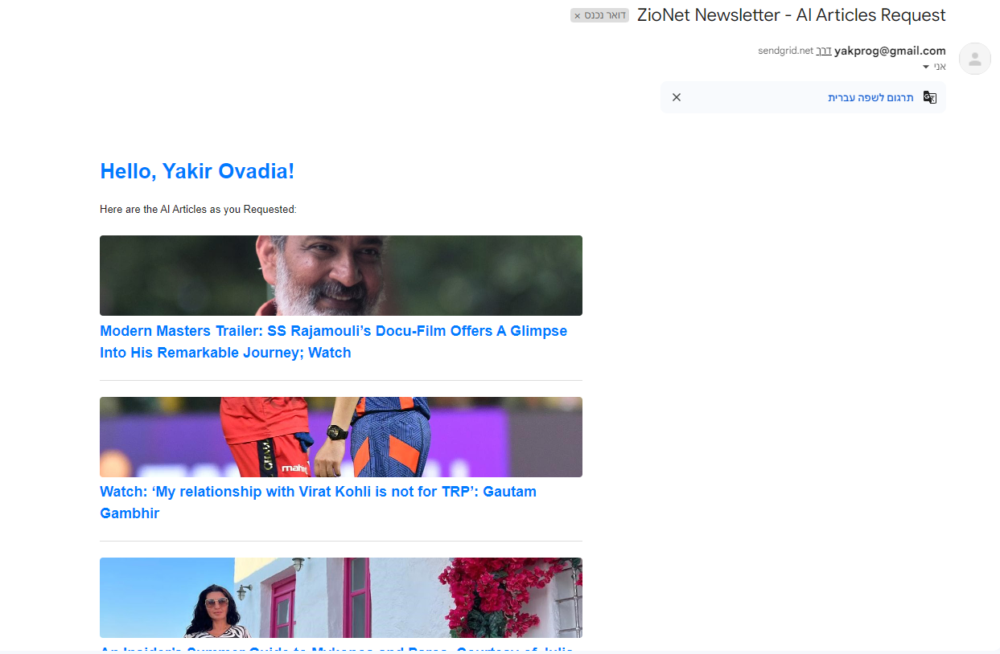

# ZioNet Final Project

The project aims to develop a microservice-based application that aggregates news and technology updates based on user preferences. The system will fetch the latest news, pick up most interesting news using AI based on user preferences (optionally generate concise summaries using AI), and send this information to users via email, Telegram, or other communication channels.

## Installation

make sure you installed docker hub on your computer than:

```bash
# Clone the repository
git clone https://github.com/yakprog/zionetFP.git

# Navigate to the project directory
cd zionetFP

# bulid and run docker-compose
docker-compose up -d --build
```

## Running Tests

To run tests, after docker compose finished go to the browser and insert the following url:

```bash
  http://localhost:3005/manager?email=youremail
```

The real emails that stored it the DB:

- yakprog@gmail.com
- venyab@zion-net.co.il

There are more emails in the db but they are not real (check db screenshot)

So Venia please run it with:

```bash
  http://localhost:3005/manager?email=venyab@zion-net.co.il
```

Then check your spam box in the email

## Screenshots

DB Document looks like that:


When everting works good docker hub will looks like that:


Request:


Response:


## Scheme


## Contact

- Yakir Ovadya - email: yakprog@gmail.com
